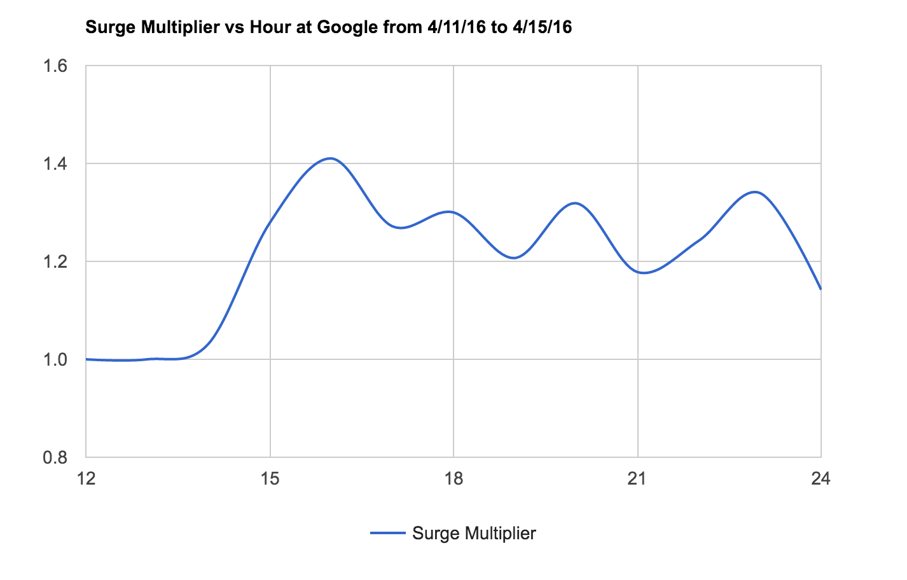
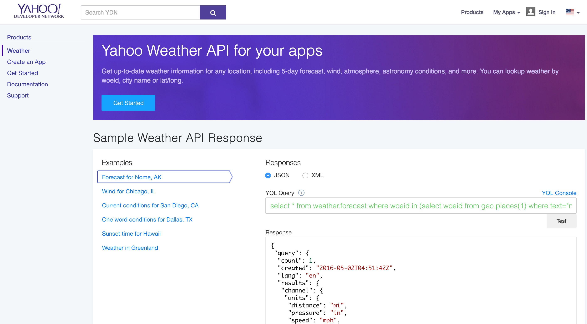

# Where New Yorkers gonna go after work?

This repository contains a collection of data and scripts that help us manage the data storage and picture plotting. The details of implementation are discussed below and within scripts as comments.


**Note**: This is the uber surge multiplier vs time from noon to midnight, generated by d3js and Google Charts.

# Project introduction

New York City, a major in the world, has a population more than 5.5 million in 2015 [1], where people working for all walks of life can be found. The general public may have impressions of New Yorkers’ life to be fast paced, stressful and having little private time. The financial industry jobs are widely known as one of the busiest careers in New York City. [2] In addition to the financial industry, other industries like the technology industry and the media industry also have considerable employee populations. This project focused on the after-work travel patterns of employees in Manhattan of the three industries, namely finance, media and technology. Studies on data will be implemented on taxi data, Uber surge pricing data, weather data and traffic incident data. In this project, six companies, Goldman Sachs, Deutsche Bank, Google, Palantir Technology, The Wall Street Journal and Bloomberg, were studied as the representatives of each of the three industries. Reasons and considerations behind selecting these companies are discussed in later sections.

On demand realtime limousine services, also called ride-share services, are gaining their popularities during recent years. Passengers can simply open an application on their smartphones and request rides anytime anywhere where the services are provided. Typical service providers in New York City and other major cities in the US are Uber, Lyft, and Gett. Before the passenger sending an actual request a ride, an estimated price (for services pricing on time and distance of the ride) or a confirmed price (for services with fixed pricing) is shown. The pricing mechanism of such services is not fixed but dynamic, which is called surging price by Uber. It is a pricing strategy used when there are high demands of ride-share services. When available Uber cars can’t satisfy a high demand from passengers in a certain area, Uber will raise the pricing rate to re-balance the supply and demand of the service. More drivers are encouraged to serve in the area with high surge price when there is limited number of available cars and relatively high demand of services.

By monitoring surge pricing in real-time, the demand of rides could be obtained. A higher demand at a specific time may highly related to peak hours. We kept monitoring the surge pricing round the clock for two weeks on weekdays and further process the data to reflect afternoon peak hours. Locations where most of the employees from the abovementioned six companies getting on a taxi or Uber vehicles were carefully chosen. The location picking schemes were detailedly discussed in later sections of this document. The surge pricing monitorings were only performed at these locations, which could relatively precisely reflect the peak hours when people were leaving their works at each of the companies.

When the peak hours of each companies were determined, further studies on travelling patterns were conducted. We seeked Uber data for picking up and dropping off first. However, Uber was neither sharing historic picking up or dropping off data, nor providing usable APIs for users to retrieve such data. In that case, a data matching was implemented to match New York City yellow cab pickup/dropoff data in April 2015 and Uber surge pricing data in April 2016 in order to reflect the travelling patterns of those employees after work. Multiple statistic schemes were used to ensure the high correlation between these two data sets.

With the travel patterns discovered, surveys were conducted to the employees from the six companies. The survey was about employees’ time of leaving work, travel intentions after work, the reasons behind their choices and etc. By collecting the survey data, the correlation between the data from taxi and Uber and survey result could be found. Those interesting discoveries in the taxi and Uber data would be better explained by stories told by the corresponding employees. In addition, company policies such as dining and travelling expense policies were also included in the reasonings of the after work travel patterns.
Moreover, historic and real-time weather data were taken into consideration when analyzing the travel patterns. This could, to some extent, reflect the elasticity of people’s choices of destinations after work.

In this project, we told the story, “Where New Yorkers gonna go after work?”, by utilizing multiple streaming data sources, APIs, databases and surveys, which will be discussed in later sections in detail.

# Included files

This repository consists of a data retrieving and data visualization.

The data retrieving is responsible for connecting to the APIs that we chose previously, figuring out the interested information helpful for our project, deciding which format of data should be stored, and utilizing AWS and NoSQL technology, i.e. DynamoDB, for storage.

The data visualization is responsible for extracting data from cloud, calculating the interesting information, such average uber surge multiplier given time period and favored date, generating streaming data with manipulatable format, and creating line charts with smoothed curvature according to the generated data.

## uber_surge
Retrieve data from uber api and store surge price multiplier to DynamoDB for 6 different companies in Manhattan every 5 seconds for further analysis.

## Weather

Main.py can crawl weather and corresponding time by yahoo_weather API and store them into our database. Considering the manhattan has the same weather, we only targeted an uniform weather. 



## Incident

This folder includes database program which is created for calling kinds of operations to database, for example, create, insert, delete and get table.

Also, we wrote incident.py to fetch incident data around specific companies through mapquest API. Specifically, given a location and a radius value and incident information can be returned and stored into dynamodb.

**Note:** Some configuration files are not uploaded since they contains either api keys or AWS credentials

## Scripts and intermediate data

- `Makefile`
	- Makefile is for easier deploy of application. `make clean` could be used to clear uncorrelated files. I define `make` for different functionality, either `main.py` for testing of data retrieving, or `plot.py` for getting analyzed information necessary for further testing.
- `main.py`
	- `main.py` is used to retrieve data from uber api to get uber surge multiplier information. Then the data are stored into DynamoDB in the format of `{name, time, surge_multiplier, lat, lon}`. `name` means company name. `lat` and `lon` represented latitude and longitude of the company's main entrance. These information are specified in the `location.json` file. `surge_multiplier` is the current surge multiplier around the location that we are interested. It has an infinite loop to retrieve uber api. One could just type `python main.py` or in AWS, type `nohup python main.py &`. AWS trigger could be used to detect exceptions.
- I use a small nodejs tool to export the DynamoDB data into a csv file, rather than the original AWS export function pipeline. The command is: `node dynamoDBtoCSV.js -t [db name] > output.csv`.
- `plot.py`
	- `plot.py` read the csv data file and analyzed the averaged surge multiplier information for further use. It stored the favored surge information from noon to midnight to a local tsv file, for the use to plot Google charts. The stored data format could be checked by taking look at the `data.tsv` file. Usage is `python plot.py`.
- `database.py`
	- `database.py` contains utility functions for accessing AWS DynamoDB, such as creating tables, insert items into tables, delete tables and get the access of the table.
- `index.html`
	- `index.html` is used to plot the uber surge multiplier vs time range by using Google Chart. One could just open the html file in Firefox. Chrome does not perform perfect since it assures one to deploy the web application on a server. It uses `d3js` to open the local tsv file and extracts the data as required json array.
- `mapquest.py`
	- `mapquest.py` does similar job to retrieve incident information.
- `location.json`
	- `location.json` contains geolocation of the 6 companies we choose as our target of investigation.
- [`config.cfg`]
	- This file is not included, unless I've sent you the repository directly (e.g. not via GitHub). You must create it yourself, or use the repository I have provided! It should contain a single line, which should look like `[dynamo]
region_name:
endpoint_url:
server_token:
[uber_api]
uber_url:
[here_api]
app_id:
app_code:
[mapquest_api]
key:
`, where url's are the interested URL, and the keys or codes or ids are the application key information.

# How to Run

## Dependencies and other requirements

Please use pip for some other Python package manager to install the following non-standard packages:

- `boto3==1.3.1`

Amazon Web Services (AWS), is a collection of cloud computing services that make up the on-demand computing platform offered by Amazon.com. These services operate from 12 geographical regions across the world. The most central and best-known of these services arguably include Amazon Elastic Compute Cloud, also known as "EC2", and Amazon Simple Storage Service, also known as "S3". AWS now has more than 70 services that range from compute, storage, networking, database, analytics, application services, deployment, management and mobile. Amazon markets AWS as a service to provide large computing capacity quicker and cheaper than a client company building an actual physical server farm.

Amazon Elastic Compute Cloud (EC2) forms a central part of Amazon.com's cloud-computing platform, Amazon Web Services (AWS), by allowing users to rent virtual computers on which to run their own computer applications.

Amazon DynamoDB is a fast and flexible NoSQL database service for all applications that need consistent, single-digit millisecond latency at any scale. It is a fully managed cloud database and supports both document and key-value store models. Its flexible data model and reliable performance make it a great fit for mobile, web, gaming, ad tech, IoT, and many other applications.

Boto3 is the Amazon Web Services (AWS) Software Development Kit (SDK) for Python, which allows Python developers to write software that makes use of services like Amazon S3 and Amazon EC2. You can find the latest, most up to date, documentation at Read the Docs, including a list of services that are supported.

```
$ pip install boto3
```

If one want to run the python files on EC2, then AWS credentials should be included in the path, and run the following:
```
$ sudo pip install boto3
```
and type the AWS password.

If one want to run locally, then

```
$ python main.py
```
If one want to run it remotely on AWS, then one could use `nohup` command.

`nohup` is a POSIX command to ignore the HUP (hangup) signal. The HUP signal is, by convention, the way a terminal warns dependent processes of logout. Output that would normally go to the terminal goes to a file called nohup.out if it has not already been redirected.
```
$ nohup python main.py &
 [enter]
$ [you are here]
```

If one want to terminate the python process, then
```
pkill main.py
```
Or alternatively,
```
ps aux | grep python
```
then a list of python process are showed, then given the id of the process, one could use
```
kill -9 [process id]
```
By running the above, one could have a hidden process requesting for API and get data inserted into DynamoDB.

## Google Chart plotting

One just need to open the `index.html` in Firefox. The project is hard to be deployed on Chrome, since there will be error message telling users that the local intermediate data file should be uploaded on a local server, while Firefox has no such requirement.
